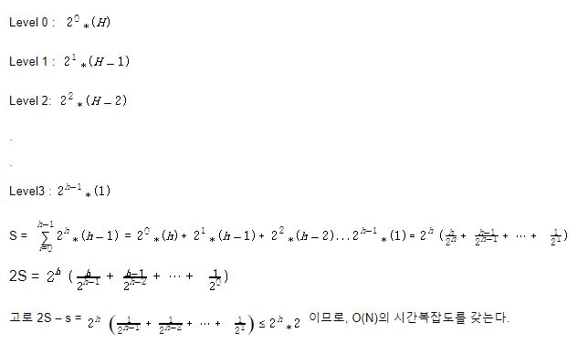

# Build Heap in Linear Time Complexity!

## Heap 의 특성
1) Heap은 완전 2진 트리이다.
2) Heap 성질과, 완전 이진트리를 만족하면 Heap이다. 
3) Insert 연산은 O(N )즉 최악의 경우 Heap의 Height 만큼 비교를 진행하게 된다. Leaf 에서 root 까지 비교를 진행 한다.
4) Delete Min or Max 연산은 해당 노드에서 leaf 까지 비교를 진행한다.

## Idea
Delete Min or Max연산의 idea3를 이용하여 Heap을 구성 할 것이다.
Leaf 에서부터 Heap을 부분적으로 구성하는 것으로,  모든 노드의 비교 회수를 따져 보았을 때 Leaf 에서부터 root 까지 올라가면서 Leaf까지 key를 비교하는 연산은 root에서부터 leaf까지 내려가면서 key를 비교하는 연산 보다 작다.
레벨이 더 높아질수록, (숫자가 높아짐을 의미함 레벨이 높을수록 트리에 아래에 위치한다.) 비교 대상 노드가 많아 지기 때문이다.
진짜 그러한가?
전체 노드에 대해 해당 idea를 이용하여 heap을 구성 할 때, 전체 노드의 비교 연산은 다음과 같다.
비교 회수를 S라고 했을 때, 

